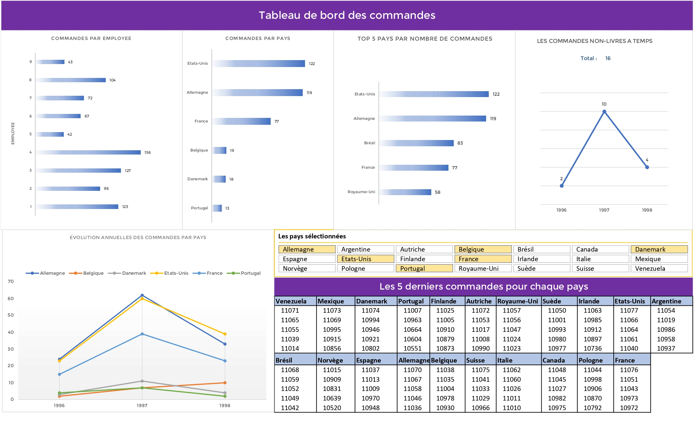

# Countries Sales Report
This report was an **_academic_** project, for the _module_ **`Construction of Dashboards`**, the data used assimulate the orders record for an **`internationnal store`**.

### - Indicators :
This dashboard covers 5 indicators as mentionned below :
  - > **_Number of sales per employee and per country_**
  
  - > **_Countries which the most orders were from_**
  
  - > **_Number of orders not delivered in time per year_**
  
  - > **_Evolution of annual orders by country_**
  
  - > **_The last 5 orders for each country_**

### - Result :
